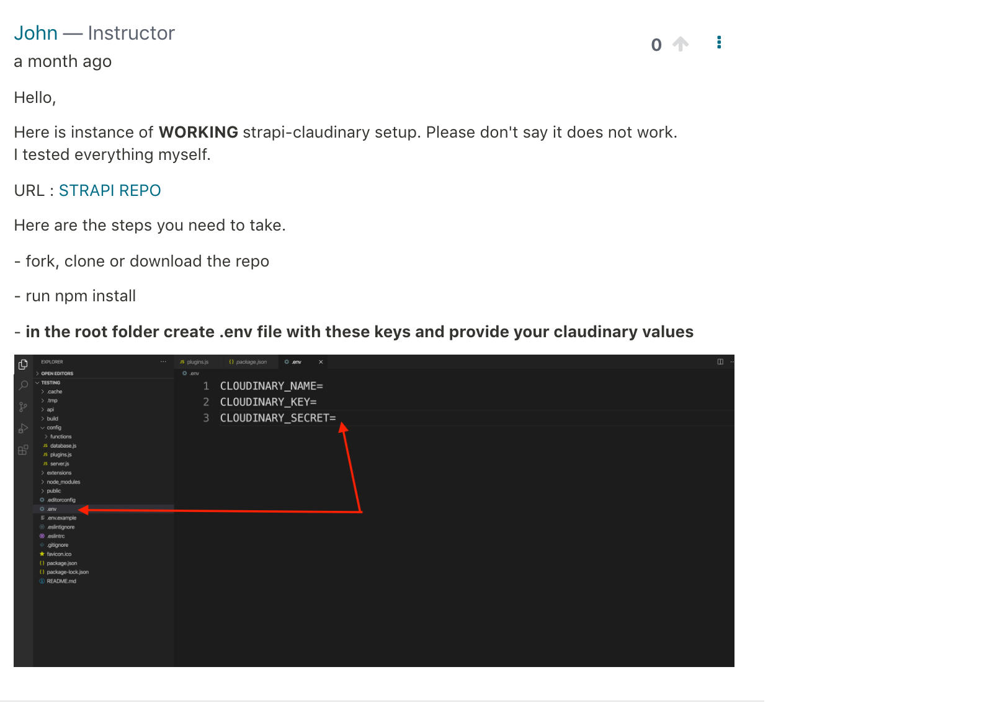
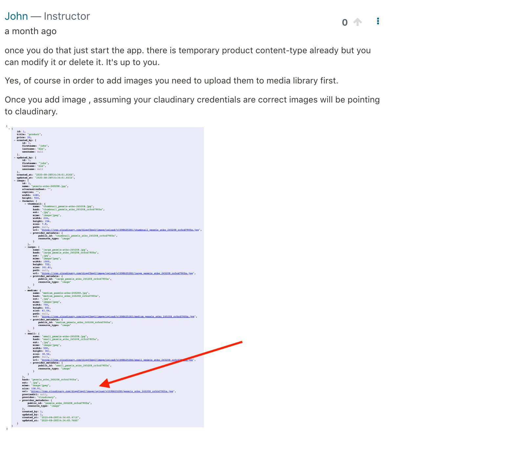

# Working Strapi, Cloudinary Setup

run npm install

create a .env file (in the root)

add these keys with your own values (no quotation marks)

```code

CLOUDINARY_NAME=
CLOUDINARY_KEY=
CLOUDINARY_SECRET=

```

run npm develop

add new image and check if the url points back to claudinary




